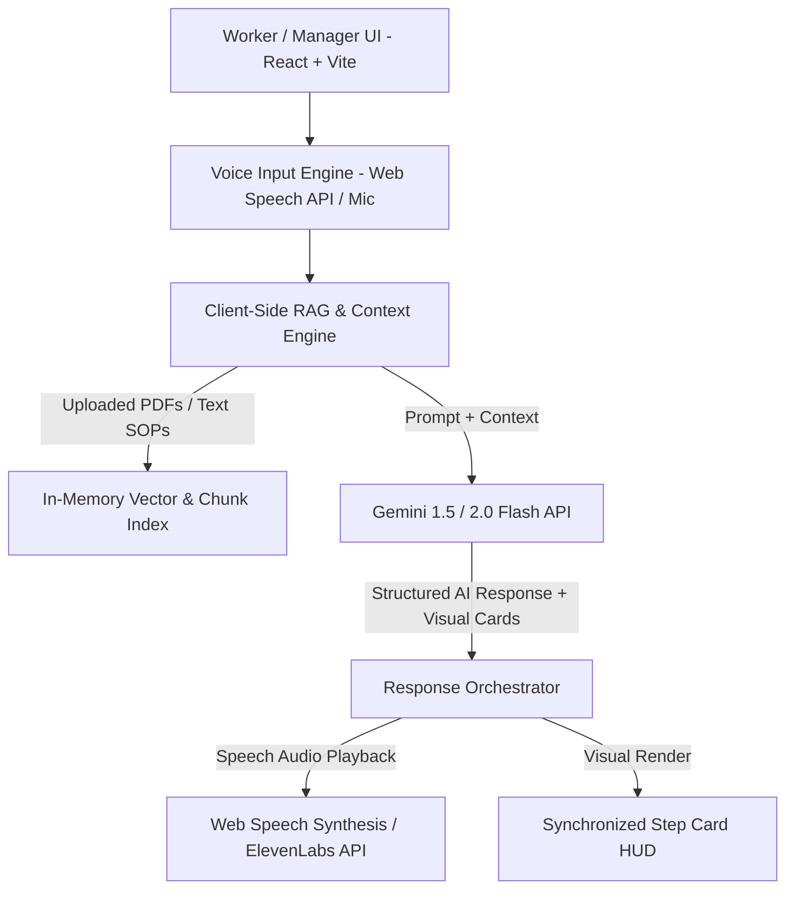

# ShiftFlow - Voice-First AI Onboarding & Micro-Learning Copilot
**Design Document**
**Date**: 2026-08-18  
**Status**: Approved (Goal Mode Execution)

---

## 1. Overview & Core Value Proposition

**ShiftFlow** is a Voice-First AI Copilot and Micro-Learning platform designed for physical, blue-collar, and shift workers (baristas, restaurant staff, warehouse technicians, repair crews). 

It addresses two major pain points in frontline work:
1. **High Turnover & Slow Onboarding**: Workers often forget complex recipes, equipment error codes, or safety procedures when on shift.
2. **Hands-Busy Environment**: Workers cannot stop operating machinery or preparing orders to flip through lengthy paper manuals or scroll on a phone.

### Solution:
- **Hands-Free Voice Q&A (Voice-to-Voice)**: Worker asks a question via headset/mic ("How do I fix Coffee Machine Error E-02?") and receives a concise 2-sentence spoken answer within seconds.
- **Synchronized Visual Step Cards**: Simultaneously displays high-contrast visual recipe/troubleshooting steps on screen for visual verification.
- **Manager KB Studio**: Managers upload SOP manuals (PDF/TXT) or use pre-loaded barista guides; indexed instantly client-side.
- **1-Minute Pre-Shift Safety & SOP Quiz**: AI-generated micro-learning quiz before every shift ensuring safety & quality compliance.

---

## 2. Target Persona & Use Case (MVP Demo)

- **Industry Focus**: Coffee Shop / Barista & Café Management.
- **Pre-Loaded Knowledge Base**:
  - **Matcha Latte Recipe (Sizes M & L)**: Ratios, steamed oat milk temperature, syrup pumps, powder whisking protocol.
  - **Espresso Machine Error E-02 (High Pressure Warning)**: Emergency shutdown, steam wand purge, boiler release safety steps.
  - **Daily Sanitization & Closing Checklist**: Milk line flush, grinder hopper wipe down, chemical safety storage.

---

## 3. System Architecture & Tech Stack

### Technology Stack:
1. **Frontend**: React (Vite), Modern Vanilla CSS with CSS variables, Glassmorphism, Dark/Light Mode, Google Font (Outfit / Inter), CSS Keyframe Audio Animations.
2. **AI & RAG Engine**:
   - **RAG**: Client-side document parser (PDF.js / text parser) + TF-IDF chunking & semantic cosine similarity index stored in LocalStorage.
   - **LLM**: Gemini API (`gemini-1.5-flash` / `gemini-2.0-flash`) with structured JSON mode fallback.
3. **Voice Engine**:
   - **Speech Recognition**: Browser `webkitSpeechRecognition` / `SpeechRecognition` API (Hands-free, real-time STT).
   - **Speech Output**: Dual Engine (Default: Native Browser `window.speechSynthesis`; Optional: ElevenLabs REST API audio stream when API key provided).

---

## 4. UI / UX Layout & Components

### 4.1 Navigation & Workspace Mode Switcher
- **Brand Identity**: ShiftFlow glowing logo, live indicator dot (Online/Offline KB state), API key status badge.
- **Role Toggle**: "Worker View (Voice HUD)" vs. "Manager View (KB Studio)".

### 4.2 Worker View: Voice HUD & Visual Step Cards
- **Audio Visualizer**: Waveform pulsing orb reacting to microphone state (Listening, Processing, Speaking).
- **Voice Trigger**: Large tactile push-to-talk button + Keyboard shortcut (`Spacebar` / `Hold to Talk`).
- **Quick Voice Chips**: Suggested one-tap voice queries ("Matcha Latte L Recipe", "Fix Error E-02", "Sanitization SOP").
- **Visual Step Card Display**:
  - Step-by-step progress cards.
  - Warning badges (High Pressure, Hot Surface).
  - Ingredient / Tool breakdown table.

### 4.3 Manager View: Knowledge Base Studio
- **Document Uploader**: Drag-and-drop file uploader for PDF / TXT / MD files.
- **Pre-Loaded SOP Selector**: One-click preset toggles (Coffee Shop, Warehouse, Equipment Maintenance).
- **Chunk Inspector**: Preview extracted text chunks, add custom manual Q&A pairs.

### 4.4 1-Minute Pre-Shift Warmup (Micro-Quiz)
- Interactive quiz pop-up/view.
- 3 random multiple-choice questions derived from active Knowledge Base.
- Instant explanation + "Shift Ready" badge unlocking worker access.

---

## 5. Non-Functional & Security Requirements

- **Operational Cost**: $0 (Runs entirely on client + free Gemini API tier + browser Web Speech API).
- **Latency Target**: Audio speech recognition to response playback under 2.5 seconds.
- **Offline & Local Storage**: Stores indexed SOPs and user settings locally in browser (`localStorage`).
- **Accessibility & Contrast**: High contrast colors tailored for high-brightness restaurant/warehouse environments.

---

## 6. Implementation Milestones

1. **Scaffold Project**: Vite + React + Vanilla CSS design system.
2. **Knowledge Base & RAG Engine**: Pre-loaded coffee shop SOP dataset + PDF/TXT uploader + Local storage indexing.
3. **Voice Engine & Gemini Integration**: Speech-to-text listener + Gemini prompt formatting + Speech synthesis output.
4. **Interactive HUD & Step Cards**: Dynamic UI cards, audio visualizer animations, quick chips.
5. **Pre-Shift Micro-Quiz Module**: AI question generator + interactive scoring UI.
6. **Polishing & Verification**: End-to-end testing with audio triggers, browser compatibility checks, visual polish.
